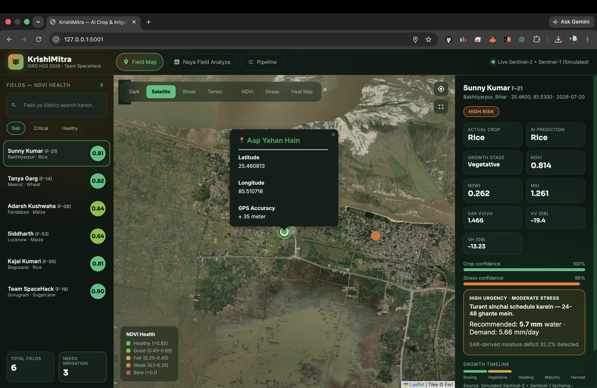

# 🌾 KrishiMitra AI

> AI-powered Crop Type, Moisture Stress Detection & Smart Irrigation Advisory System

Built for **ISRO Bharatiya Antariksh Hackathon 2026** by **Team SpaceHack**


---

## 📸 Dashboard Preview


---

## 📖 Overview

KrishiMitra AI is an intelligent agriculture platform that combines simulated satellite imagery, machine learning, weather analysis, and irrigation advisory into a single interactive dashboard.

The platform helps farmers monitor crop health, detect moisture stress, and receive smart irrigation recommendations using satellite-derived vegetation indices and AI models.

---

## ✨ Features

- 🛰️ Satellite-based Crop Monitoring
- 🌱 AI Crop Classification
- 💧 Smart Irrigation Recommendation
- 📍 Interactive GIS Dashboard
- 🌦️ Weather Integration
- 📅 7-Day Weather Forecast
- 📄 PDF Report Generation
- 📤 CSV Data Export
- 🔍 Location Search — autocomplete with recent-search history & keyboard navigation
- 📊 NDVI, NDWI & MSI Visualization
- 📱 Responsive UI
- 🌗 Dark / Light Theme Toggle — remembers your choice and follows your system preference

---

# 🏗 System Architecture

```text
Satellite Data
      │
      ▼
Preprocessing
      │
      ▼
Feature Extraction
      │
      ▼
AI Models
      │
      ▼
Decision Engine
      │
      ▼
Interactive Dashboard
```

---

# 🛠 Tech Stack

| Category | Technologies |
|----------|--------------|
| Frontend | HTML5, CSS3, JavaScript |
| Backend | Flask, Python |
| AI/ML | Scikit-learn, Pandas, Joblib |
| Mapping | Leaflet.js, OpenStreetMap |
| Satellite | Sentinel-2 (Simulated), Sentinel-1 SAR (Simulated) |
| Reports | jsPDF |
| Deployment | Docker |

---

# 📂 Project Structure

```text
krishimitra-ai/
│
├── app.py
├── model/
├── static/
├── templates/
├── docs/
├── tests/
├── requirements.txt
├── Dockerfile
└── README.md
```

---

# ⚙ Installation

```bash
git clone https://github.com/SunnyAgrwl05/krishimitra-ai.git

cd krishimitra-ai

python -m venv venv

source venv/bin/activate
# Windows:
# venv\Scripts\activate

pip install -r requirements.txt
```

---

# 🚀 Run the Project

Train the AI models

```bash
python model/generate_training_data.py
python model/train_model.py
```

Start the Flask server

```bash
python app.py
```

Open

```
http://localhost:5001
```

---

# 📡 REST API

| Endpoint | Method | Description |
|----------|--------|-------------|
| `/api/fields` | GET | Fetch all monitored fields |
| `/api/analyze` | POST | Analyze a custom location |
| `/api/weather` | GET | Weather information |
| `/api/forecast` | GET | 7-day weather forecast (Open-Meteo) |
| `/api/history` | GET | Analysis history |
| `/api/dashboard` | GET | Dashboard statistics |
| `/api/search-location?q=<query>` | GET | Location autocomplete — `<query>` is the place name to search (Photon/OpenStreetMap, India-focused) |
| `/api/model-metrics` | GET | AI model performance |
| `/api/export/csv` | GET | Download dashboard field data as CSV |
| `/api/health` | GET | Health check |

---

# 🔍 Location Search

The **Analyze → Step 1 (Location)** panel includes a smart location search so
you can find a farm by name instead of typing raw coordinates.

- **Autocomplete suggestions** as you type (from 3 characters), matching even
  partial words — e.g. `luckno` → *Lucknow*.
- **Auto-fills** Latitude/Longitude and Village/District/State on selection.
- **Recent search history** (kept in the browser's Local Storage) with a
  one-click **Clear** — no duplicate entries.
- **Keyboard navigation** — `↓`/`↑` to move, `Enter` to select, `Esc` to close.
- **Match highlighting**, a **loading indicator**, and graceful **error
  handling** with a **Retry** button on network failure.
- Debounced input + in-memory caching for **faster, lighter** lookups.

Suggestions are served by the app's own `GET /api/search-location?q=<query>`
endpoint, which proxies [Photon](https://photon.komoot.io) — an
OpenStreetMap-based geocoder designed for type-ahead search. Results are
focused on India using a geographic bounding box. The endpoint always responds
gracefully — an empty list with a note — if the upstream geocoder is
unreachable. Manual latitude/longitude entry and the 📍 *Auto-fill Coordinates*
(device geolocation) button continue to work as before.

### Why Photon and not Nominatim?

Both are **free, no-API-key geocoders built on the same OpenStreetMap data**,
but they are built for different jobs, and the choice matters for a
search-as-you-type box:

| Aspect | Nominatim | **Photon (chosen)** |
|---|---|---|
| Designed for | Full-address & reverse geocoding | **Autocomplete / type-ahead** |
| Partial words | ❌ needs complete words | ✅ matches prefixes (`luckno` → *Lucknow*) |
| Typo tolerance | Minimal | Some built in |
| Public-API policy | Discourages autocomplete use; ~1 req/sec | Meant for many small type-ahead requests |

The deciding factor: Nominatim's `/search` only matches **complete words**, so
typing `luckno` returns **nothing** — unusable for an autocomplete box (and
Nominatim's own docs advise against using its public API this way). Photon was
built specifically as the autocomplete companion to Nominatim and matches
partial input instantly, which is exactly what this feature needs.

> **Note:** Nominatim is still the better tool for one-shot *full-address*
> geocoding and *reverse* geocoding (coordinates → address). Photon is chosen
> here only because this is a live autocomplete experience. The India focus uses
> a bounding box (Photon's free tier has no country-code filter), so it may
> include small border areas of neighbouring countries. Both public instances
> are free/shared and fine for this project; heavy production traffic would call
> for a self-hosted or paid geocoder.

---

# 🧠 AI Pipeline

- Satellite Image Simulation
- Feature Extraction
- Crop Classification
- Moisture Stress Detection
- Decision Engine
- Smart Irrigation Advisory
- Dashboard Visualization

---

# 📊 Satellite Features

The AI model uses the following satellite-derived parameters:

- NDVI
- NDWI
- MSI
- VV Backscatter
- VH Backscatter
- VV/VH Ratio
- Growth Fraction

---

# 👥 Team SpaceHack

- 👩 Tanya Garg (Team Leader)
- 👨 Sunny Kumar
- 👨 Adarsh Kushwaha
- 👨 Siddharth

---

# 🔮 Future Improvements

- Google Earth Engine Integration
- Live Sentinel Data
- Mobile Application
- Multi-language Support
- Farmer Authentication
- Yield Prediction
- Disease Detection
- SMS & WhatsApp Alerts

---

# 📜 License

This project is developed for the **ISRO Bharatiya Antariksh Hackathon 2026** by **Team SpaceHack**.

For learning, research, and demonstration purposes.

---

# 🤝 Contributing

Contributions are always welcome!

If you'd like to improve KrishiMitra AI:

1. Fork this repository
2. Create a feature branch

```bash
git checkout -b feature/amazing-feature
```

3. Commit your changes

```bash
git commit -m "feat: add amazing feature"
```

4. Push your branch

```bash
git push origin feature/amazing-feature
```

5. Open a Pull Request

---

# 🌱 Contributors

KrishiMitra AI is built and improved by our open-source community. A live
**Contributors** tab is available in the dashboard top navigation — it fetches
the latest contributors straight from the GitHub API and shows their avatars,
usernames, contribution counts, and profile links.

<a href="https://github.com/SunnyAgrwl05/krishimitra-ai/graphs/contributors">
  
</a>

Thank you to everyone who has contributed! ❤️

---

# 🖼️ Additional Screenshots

## 📍 Field Monitoring Dashboard

<p align="center">
  
</p>

---

# 📈 Project Highlights

- 🚀 End-to-End AI Agriculture Pipeline
- 🛰️ Satellite-based Crop Monitoring
- 🌱 AI Crop Type Prediction
- 💧 Smart Irrigation Advisory
- 📊 NDVI, NDWI & SAR Analytics
- 🌦️ Weather Information Integration
- 📄 Professional PDF Report Generation
- 🗺️ Interactive GIS Dashboard
- ⚡ Fast REST APIs
- 📱 Responsive Modern UI

---

# 🌍 Real-World Applications

- Smart Farming
- Precision Agriculture
- Irrigation Planning
- Crop Health Monitoring
- Agricultural Decision Support
- Government Agriculture Programs
- Satellite Data Analytics
- Remote Sensing Research

---

# 🙏 Acknowledgements

Special thanks to:

- 🇮🇳 ISRO – Bharatiya Antariksh Hackathon 2026
- Sentinel-1 & Sentinel-2 Mission
- OpenStreetMap
- Leaflet.js
- Flask
- Scikit-learn
- Python Community

---

# 📬 Contact

**Sunny Kumar**

- GitHub: https://github.com/SunnyAgrwl05
- LinkedIn: https://linkedin.com/in/sunny-kumar-a06484297

For collaboration, feedback, or project discussions, feel free to connect.

---

<p align="center">

### ⭐ If you found this project useful, please consider giving it a Star!

Made with ❤️ by **Team SpaceHack**

</p>


